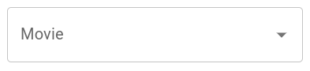

# 
A Complete Guide For Front-end Development

## INDEX

- ### Form element's

# Form Elements:

- ## AutoComplete
- ## Button
- ## Button Group
- ## Checkbox
- ## Floating Action Button
- ## Radio Group
- ## Rating
- ## Select 
- ## Slider
- ## Switch
- ## Text Field
- ## Transfer List
- ## Toggle Button

## 1. Auto Complete : 

### The Autocomplete is a normal text input enhanced by a panel of suggested options.

- ## Combo Box :
    ### Value Must be Chosen form a predefined set of allowed values.

    

- ## Free solo : 
    ### Set freeSolo to true so that textbox can contain any arbitrary value.

## Button : 

### Button allow users to take actions and make choices with a single tap.

- ## Basic button
    ### The Button comes with three variants 
    - text (default)
    - contained
    - outlined

- ## Text Button
    ### Text buttons are typically used for less-pronounced actions, including those located: in dialogs, in cards, In cards, text buttons help maintain an emphasis on card context

    - primary 
    - disabled
    - link 
- ## Contained button: 
    Primary Actions that are primary to your app.

- ## Outlined button: 
    - primary
    - desabled 
    - link

- ## Handing Clicks: 
    - onClick

- ## Color: 
    color = 

- ## Sizes: 
    - small
    - medium 
    - large

- ## Buttons with icons and label
    - startIcon
    - endIcon

- ## icon Button :
- ## size
- ## clor props for the component
- ## comples button

# Button Group

- ## Basic button group
    Varient= contained
    arial-label: outlined button group

- ## Vertical group
    button can display vertical
    - orientation

- ## Split button

# Checkbox 

- # Basic checkboxes
    - defaultChecked
    - desabled
    - disabled checked

- # label
    - form control label
    
- # size
    - small
    - medium 
    - large
- # color
    - color 
    - checked color

- # Icon
    - normal 
    - checked

- # Controlled 
    - checked
    - onChange

- # Indeterminate - have to learn

- # FormGroup
- # Label placement 
    - value: top
    - control
    - label
    - labelPlacement

- # Customization
    - 

# Floating Action Button
A Floating Action Button (FAB) performs the primary, or most common, action on a screen.

- primary 
- secondary
- extended
- disabled

## Size : 
- small
- medium 
- large

## Animation: 
- zoom           -- learn

# Radio group

The Radio Group allows the user to select one option from a set.

## Direction
- row
- column

## Controlled 
- value 
- onChange

## Standalone radio buttons
- 

## Size
- small 
- medium
- large

## Color

## Label placement

## Show error

# Rating 
## Basic rating
- controlled 
- Read only
- Disabled
- No rating given

## Rating Precision  

## Hover feedback

## Sizes

## Customization

# Select
Select components are used for collecting user provided information from a list of options.

## basic select 

# Slider
- continuous sliders
- Sizes
- Discrete sliders
- Small steps
- Custom marks

## Range Slider
## Minimum distance
## Slider with input field 
## Color
## Customiztion
## music player 
## Vertical sliders

